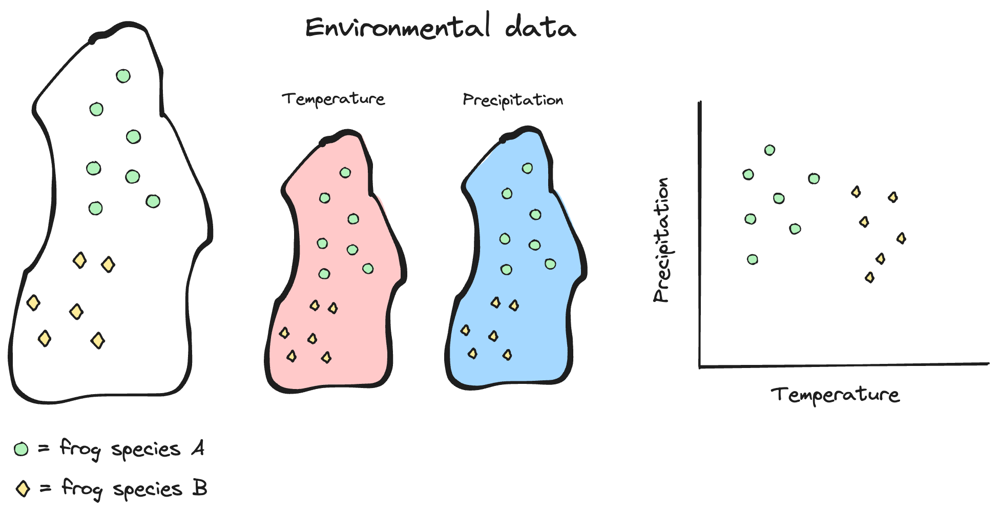

Lab Introduction
================

## Who I am

#### Scientist

My name is [Connor French](https://connor-french.com/) (call me Connor)
and I’m a sixth year PhD candidate in Biology- Ecology, Evolution, and
Behavior! I’m advised by [Dr. Mike
Hickerson](https://hickerlab.wordpress.com/) and unofficially co-advised
by [Dr. Ana Carnaval](https://www.carnavallab.org/ana). Outside of my
research I enjoy spending time outside with my dog, playing music, and
film photography!

#### Science

I study how populations, species, and communities evolve in response to
changing environments. My research has mainly centered around how
population sizes and connectivity change in response to large historical
climate shifts across the late Pleistocene and Holocene (\~129,000 years
ago to the present day) and what impact this has on species and
communities. Most of my research is conducted on tropical reptiles and
amphibians because they are what excite me the most, but I do work on
other animals and in other areas- for instance, I recently published a
paper [mapping the genetic diversity of insects across the
globe](https://doi.org/10.1038/s41467-023-40936-0). I consider my
research important because it offers a glimpse into how species and
communities made it to where they are now, it provides a baseline to
predict where they may go in the future, and perhaps most critically,
whether they will survive into the future.

I use a combination of field work, lab work, and computational work to
answer the questions I’m interested in. Because fossils are few and far
between, I sequence the DNA of lizards and frogs across their current
geographic ranges to understand their pasts. DNA contains the history of
an organism’s ancestry, and even can tell us the history of entire
populations- how a population may have shrank or expanded in the past
and whether they exchanged migrants with other populations. After I have
collected the organisms in the field and sequenced their DNA in the lab,
I analyze the data on a computer. I use everything from my personal
laptop to a super computer at the American Museum of Natural History to
run my analyses. I use a combination of statistics, machine learning,
and simulations to tease apart the potential ecological and evolutionary
forces driving the patterns that I observe.

<figure>

<figcaption aria-hidden="true">A photo of a waxy monkey tree frog I
sampled in the field in the Brazilian Atlantic Forest.</figcaption>
</figure>

<figure>

<figcaption aria-hidden="true">Typical habitat that I conduct field work
in. A fragment of tropical forest on the edge of agricultural land in
the Brazilian Atlantic Forest.</figcaption>
</figure>

#### Data

In addition to DNA sequences, I use ecological information to inform my
analyses. I aggregate records of where the lizards or frogs I study have
been observed and used that to obtain ecological information from online
databases. For instance, if I want to get a broad understanding of the
environmental tolerances of the tree frogs I study, I take the locations
where they have been observed, extract the average annual temperature
and precipitation of these locations from the online database, and
summarize those values using measurements like the average or spread of
those values. I can compare these ecological measurements between
species or populations to see how their ecological tolerances differ and
how they might change over time!

Here’s an illustration of the process:

<figure>

<figcaption aria-hidden="true">The geographic study area is indicated
with the black outline, while the observed localities of two frog
species are indicated with the symbols. I can download temperature and
precipitation for the study area from a database and extract those
values for the observed localities to get an idea of differences in
environmental tolerances for the two species.</figcaption>
</figure>

It looks like frog species A likes it a bit cooler and wetter than frog
species B!

## Purpose of the lab

The lab portion of the course is mainly devoted to goals (2) and (3)
from the syllabus:

> \(2\) use exploration and experiential problem-solving to become
> familiar with how scientists ask questions, collect data, and analyze
> it to further knowledge; and 3) develop core technological skills in
> Microsoft Excel and the statistical programming language R to
> kick-start their success in future science courses and labs and
> research endeavors

We will use real data from the scientists you meet during the lecture
portion to satisfy these goals!

## Learning outcomes

What you tackle during the lab will contribute to all of the learning
outcomes stated in the syllabus.

> |                                                                                               |
> |-----------------------------------------------------------------------------------------------|
> | 1\. Explain how undertaking biological research differs from studying biology in a classroom. |
> | 2\. Understand the diverse backgrounds from which scientists come.                            |
> | 3\. Understand research fundamentals.                                                         |
> | 4\. Understand advanced functions of Microsoft Excel.                                         |
> | 5\. Manipulate data and undertake analysis in the R statistical computing language.           |

## How a lab will typically go

Labs will have a “Data Science” section and an “Excel/R” section. The
Data Science section will cover research methods, scientific techniques,
and feedback on your group projects (we will go over your group projects
next week!). The Excel/R section will familiarize you with the two
pieces of software and cover hands-on data recording and analysis using
real data from the presenters!

Each week will involve working through a research question involving
data from that week’s presenter, where you will evaluate or ask your own
scientific question, form hypotheses, investigate research data,
visualize and analyze the data, and interpret your analyses. The lab
will focus on particular Data Science and Excel/R concepts specific to
that week.

## Semester outline

We have a tentative schedule for what the lab will cover, but it is
subject to change depending on how I feel y’all are progressing. This is
the first time this class is being taught, so I will be learning from
you just like you will be learning from me!

|          |                  |                 |                       |              |             |                                                  |
|----------|------------------|-----------------|-----------------------|--------------|-------------|--------------------------------------------------|
| **Week** | **Lecture Date** | **Lecture Day** | **Speaker**           | **Lab Date** | **Lab Day** | **Topic**                                        |
| 1        | Jan 29           | Mon             | First class           | Jan 31       | Wed         | Introduction/Excel overview                      |
| 2        | Feb 5            | Mon             | Susan Perkins         | Feb 7        | Wed         | Experiment components/Entering data              |
| 3        | Feb 12           | Mon             | Lincoln’s Birthday    | Feb 14       | Wed         | Projects/Formula basics                          |
| 4        | Feb 19           | Mon             | President’s Day       |              |             |                                                  |
| 5        | Feb 21           | Wed             | Shubha Govind         | Feb 22       | Thu         | (Mon schedule). Data ethics/Import & clean data  |
| 6        | Feb 26           | Mon             | David Lohman          | Feb 28       | Wed         | (Mon schedule). Experimental design/Sorting data |
| 7        | Mar 4            | Mon             | Bao Vuong             | Mar 6        | Wed         | Data visualization                               |
| 8        | Mar 11           | Mon             | Mark Emerson          | Mar 13       | Wed         | Filtering data                                   |
| 9        | Mar 18           | Mon             | David Jeruzalmi       | Mar 20       | Wed         | Project check-in/Tables                          |
| 10       | Mar 25           | Mon             | Mike Hickerson        | Mar 27       | Wed         | Descriptive statistics                           |
| 11       | April 1          | Mon             | Mark Hauber           | Apr 3        | Wed         | Intro to coding/R                                |
| 12       | Apr 8            | Mon             | Rob Anderson          | April 10     | Wed         | Functions/Data structures                        |
| 13       | Apr 15           | Mon             | Jay Edelman           | April 17     | Wed         | Data visualization                               |
| 14       | Apr 22           | Mon             | Spring Break          |              |             |                                                  |
| 15       | Apr 29           | Mon             | Spring Break          | May 1        | Wed         | Project check-in/Statistics                      |
| 16       | May 6            | Mon             | Karin Block           | May 8        | Wed         | Putting everything together                      |
| 17       | May 13           | Mon             | Student Presentations | May 15       | Wed         | Presentations                                    |

## Grading

|                                                    |     |
|----------------------------------------------------|-----|
| **The final grade will be calculated as follows:** |     |
| Attendance                                         | 20% |
| Lab assignments                                    | 60% |
| Final projects                                     | 20% |

You will have 12 lab assignments, worth 5 points each. Each lab
assignment will be due before the following lab section. I will accept
labs one day late for 2 point deduction, but more than one day late
results in a zero. You will have opportunities throughout the semester
to earn extra credit.

The final project will be a group research project that culminates in a
final presentation. I will give more details on the final project on
week 3.

## Blackboard

All lab materials will be hosted on Blackboard. Your grades will be
posted there as well. I send emails to the class through Blackboard, so
make sure to check your email that’s associated with Blackboard!



# Excel introduction

## Installation

If you do not have installed Microsoft Office 365 installed on your
computer, follow [City College’s
instructions](https://www.ccny.cuny.edu/it/microsoft-office-365-students)
to install the latest version (for free).

## What is Excel?

It is a spreadsheet program developed by Microsoft. Excel organizes data
in columns and rows and allows you to do mathematical functions. It runs
on Windows, macOS, Android and iOS.

## Why use Excel?

- Everyone uses it. Scientists, finance professionals, fantasy football
  players, DnD dungeon masters, you name it.
- It has a low barrier to entry.
- It is versatile- there are many tools that Microsoft and other
  developers have made to make different tasks like data analysis and
  accounting easier.
- There is a lot of advanced functionality that you can access as you
  learn more
- There is a lot of community support

## Navigating Excel

After you have logged on through [www.office.com](www.office.com), click
on the Excel icon to enter Excel.

After entering Excel, click on the New blank workbook button to open a
new workbook

Enter a name for the workbook (call it whatever you like) and hit Enter.

There is a lot to take in on the screen, but don’t get too stressed out!
We are going to tackle each component one at a time.

> Note, my Excel window may look slightly different than yours. The
> layout should be similar, but please ask questions if something
> doesn’t look right!

Excel has **columns** and **rows**, displaying data in a tabular format.
Rows are indicated with numbers and columns are indicated with letters.
Each rectangle is a **cell** and is associated with a column, row index.
For instance, the first cell in the workbook is column A, row 1. This
would be expressed as `A1`.

## Layout

Excel is composed of two main parts- a **Ribbon** and a **Sheet**.

### The Ribbon

The **Ribbon** provides shortcuts to Excel commands. A *command* is an
action that allows you to make something happen. This can for example be
to: insert a table, change the font size, or to change the color of a
cell.

It may seem overwhelming at first, but don’t worry- you will soon be
able to navigate it with ease! There are certain commands that you will
use more than others and can focus your mental efforts on finding.

The **Ribbon** is made up by the **App launcher**, **Tabs**, **Groups**
and **Commands**.

#### App launcher

The App launcher icon has nine dots and is called the Office 365
navigation bar. It allows you to access the different parts of the
Office 365 suite, such as Word, PowerPoint and Outlook. App launcher can
be used to switch seamlessly between the Office 365 applications.

#### Tabs

The tab is a menu with sub divisions sorted into groups. The tabs allow
users to quickly navigate between options of menus which display
different groups of functionality.

#### Groups

The groups are sets of related commands. The groups are separated by the
thin vertical line break.

#### Commands

The commands are the buttons that you use to do actions.

### The Sheet

The **Sheet** is a set of rows and columns. Values can be typed to cells
and can be both numbers and letters:

*Can you guess the index of the cell that “Hello World” was typed in?*

If you’re unsure, you can click on the cell and look at the **Name Box**
just above the **A** column.

### Multiple sheets

You aren’t limited to a single sheet in your workbook! To add a new
sheet, you can click the plus icon next to the “Sheet#” tab, where “\#”
is the number of the last sheet you created.

It’s often helpful to rename your sheets to something more useful. To do
this, right-click (or `Ctrl-click`) and select “Rename” from the pop-up
menu. Enter your desired name and click “OK”.

***Try it out:  
***Try adding a new sheet, then renaming the two sheets to whatever you
would like!

Excel materials inspired or sourced from
[W3Schools](https://www.w3schools.com/). Lab materials inspired by [Data
Nuggets](https://datanuggets.org/).
