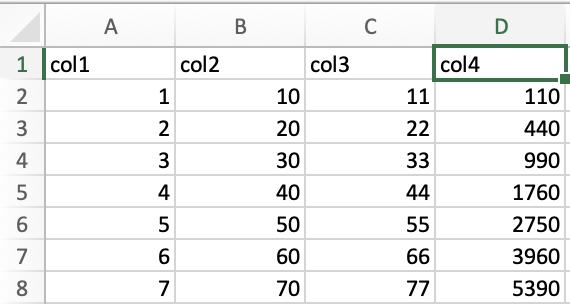

# Blood parasites in New World vultures

#### Featured scientists

[Dr. Susan Perkins](https://www.susanperkins.net/)

### Research Background

- Host-parasite evolution is tightly intertwined

- The parasites rely on hosts for their reproduction and development,
  but hosts are negatively impacted by the parasites

- Parasites adapt to better infect their hosts, while hosts adapt to
  resist infection, leading to parallel evolutionary trajectories

- It’s expected that closely related parasites will infect closely
  related hosts

- Haemosporidian parasites- parasites that infect blood cells

- Malaria is spread from Haemosporidian parasites

- Haemosporidians infect all major animal taxa

  - define taxa

- Haemosporidians are especially diverse in birds

- While host-parasite relationships in haemosporidian parasites are
  well-known across most bird species, knowledge about those that infect
  vultures is still very limited

- New World vultures are similar in appearance and in the functional
  role they play in the ecosystem as scavengers, but they have evolved
  unique physical and behavioral differences

- Of the New World vultures, the turkey vultures (*Cathartes aura*) and
  black vultures (*Coragyps atratus*) are the most widespread,
  distributed from southern South America into the United States and
  even Canada in the case of the turkey vultures

- Dr. Susan Perkins and colleagues set out to investigate the presence
  and diversity of haemosporidian parasites in turkey vultures and black
  vultures

- Yabsley et al. (2018)

- They sampled blood and tissue from vultures in six US states

- They extracted DNA from these samples and used a method called
  polymerase chain reaction (PCR) to amplify DNA strands that are known
  to be unique to haemosporidian parasites

- They compared the number of haemosporidians detected in turkey
  vultures and black vultures, expecting haemosporidians to be present
  in the blood of both vulture species, since they play similar roles in
  the ecosystem

- Using the extracted DNA and physical features of the parasites, they
  also sought to describe the evolutionary diversity of the sampled
  haemosporidians to see how it compared with existing knowledge of
  blood parasite evolutionary diversity

### Scientific Question

Do haemosporidians infect turkey vultures and black vultures equally?

### Scientific Data

| Species        | State          | Sample type | PCR      |
|:---------------|:---------------|:------------|:---------|
| Turkey vulture | California     | blood       | negative |
| Turkey vulture | California     | blood       | positive |
| Turkey vulture | California     | blood       | negative |
| Turkey vulture | California     | tissue      | negative |
| Turkey vulture | Florida        | tissue      | positive |
| Turkey vulture | Florida        | blood       | negative |
| Turkey vulture | Florida        | blood       | negative |
| Turkey vulture | Florida        | blood       | negative |
| Turkey vulture | Georgia        | blood       | negative |
| Turkey vulture | Georgia        | tissue      | negative |
| Turkey vulture | Georgia        | blood       | negative |
| Turkey vulture | Pennsylvania   | blood       | positive |
| Turkey vulture | Pennsylvania   | blood       | negative |
| Turkey vulture | South Carolina | blood       | positive |
| Turkey vulture | South Carolina | blood       | positive |
| Turkey vulture | South Carolina | blood       | negative |
| Turkey vulture | Virginia       | blood       | positive |
| Turkey vulture | Virginia       | tissue      | negative |
| Turkey vulture | Virginia       | blood       | negative |
| Turkey vulture | Virginia       | blood       | negative |
| Black vulture  | Georgia        | blood       | negative |
| Black vulture  | Georgia        | tissue      | negative |
| Black vulture  | Georgia        | blood       | negative |
| Black vulture  | South Carolina | blood       | negative |
| Black vulture  | South Carolina | blood       | negative |
| Black vulture  | South Carolina | blood       | negative |
| Black vulture  | Virginia       | blood       | negative |
| Black vulture  | Virginia       | blood       | negative |
| Black vulture  | Virginia       | blood       | negative |

Results of haemosporidian detection on New World vultures from the
United States, adapted from Yabsley et al. 2018.

Dependent variable:

Independent variable(s):

### Excel exercise

Now you are going to take the data presented above and enter it into an
Excel spreadsheet. Data entry, while often tedious, is an important
skill that demands concentration and can be streamlined using techniques
that I will demonstrate here.

#### Navigating Excel

You can navigate around Excel by clicking, or you can deftly maneuver
around your spreadsheet using your keyboard. After clicking on a cell,
you can use the left, right, up and down arrows (⬅️➡️⬆️⬇️) on your
keyboard to navigate cell-by-cell in any of those directions. Where the
true power of navigating with your keyboard comes in is through using
`ctrl/cmd` + ⬅️➡️⬆️⬇️ to skip to the farthest extents of your
spreadsheet instantly. For instance, starting with cell `A1` in the
following spreadsheet:

Pressing `ctrl/cmd` + ➡️ immediately transfers you to cell `D1`.

This is most powerful when combined with selecting ranges of data, which
is outlined in the next section.

#### Selecting data

The most basic way to select a single cell is by clicking on the desired
cell. To select multiple cells, you can use `ctrl/cmd + click`. You need
to hold `ctrl/cmd` down for every cell that you click on to select all
of them.

For instance, I held down `ctrl/cmd` and clicked on cells `A2`, `B3`,
and `C2` in the following example.

To select an entire column, click on the column letter. For instance, I
clicked the column letter **B** to select **column B**. Note, the
selection extends beyond the range of my data in the spreadsheet, which
is normal.

Similarly, to select a row in the spreadsheet, you should click on the
row number. Here, I clicked on **row 4** to select the entire row.

To select the whole spreadsheet, click on the triangle in the top-left
corner of the spreadsheet.

Finally, you can select ranges in the data using two main methods: the
“click and drag” method and the keyboard method. But first, let’s
examine how a range of data is indicated. In the image below, the range
of the selected data is `A1:C6`.

The top left corner is indicated by the first index, while the bottom
right corner is indicated by the second index.

The “click and drag” method is convenient for selecting moderate ranges
of data, where you click on the cell where you want to begin, hold the
click, and drag your mouse across the range of data that you would like
to select. It’s difficult to display in a static medium, so ask me if
you’re confused.

The keyboard method is useful for selecting a variety of ranges of data.

To select a small range of data, click on the cell where you want to
begin, press `shift` and hold `shift` down while you navigate with your
keyboard arrows. For instance, in the following example I clicked on
cell `A1`, held `shift`, and pressed ➡️ twice to select the range
`A1:C1`.

To select ranges of data that span to the edges of your data set, you
will click on your desired starting point, hold `shift + ctrl/cmd`, and
press a keyboard arrow. For instance, to select the range `B3:B8` in the
following example, I clicked on `B3`, held `shift + ctrl/cmd`, then
pressed ⬇️.

The keyboard method is especially powerful as you combine keystrokes.
For instance, I expanded the above selection to include the range
`B3:D8` by pressing ➡️ while still holding down `shift + ctrl/cmd`.

You can even de-select data by pressing an arrow in the direction of the
data you want to de-select. For instance, I de-selected the data in
**column D** from the above selection by holding `shift` and pressing
⬅️.

You can become a data selection wizard by combining the “click and drag”
method with the keyboard method to rapidly navigate and choose the data
you need!

#### Filling data

Filling data makes data entry much easier by filling ranges with values,
so you don’t have to type in every single value.

To learn about filling data, I will direct you to
[w3schools](https://www.w3schools.com/excel/excel_filling.php), who
provide an excellent introduction to the subject.

### Visualize the data

### Interpret the data

Based on the data - make a claim that answers the scientific question -
What evidence was used to write your claim? - Explain your reasoning and
why the evidence supports your claim

### Next steps as a scientist

- Science is an ongoing process. What new question do you think should
  be investigated?
- What future data should be collected to answer your question?
  - Independent variables/dependent variables
- For each variable, explain why you included it and how it could be
  measured
- What hypothesis are you testing in your experiment?

### References

Yabsley, Michael J., Ralph E. T. Vanstreels, Ellen S. Martinsen,
Alexandra G. Wickson, Amanda E. Holland, Sonia M. Hernandez, Alec T.
Thompson, et al. 2018. “Parasitaemia Data and Molecular Characterization
of Haemoproteus Catharti from New World Vultures (Cathartidae) Reveals a
Novel Clade of Haemosporida.” *Malaria Journal* 17 (1): 12.
<https://doi.org/10.1186/s12936-017-2165-5>.

## [Weekly Feedback Form](https://forms.gle/RCWtYoAtQGNd8JL38)

Excel materials inspired or sourced from
[W3Schools](https://www.w3schools.com/). Lab materials inspired by [Data
Nuggets](https://datanuggets.org/).
