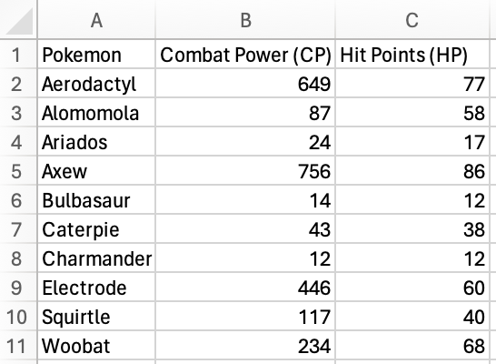

# Week 3, Excel functions and project overview

## Excel Formulas

Today, you will be learning about Excel formulas and a few useful
functions! Formulas are a fundamental and powerful feature in Excel.
They allow you to perform calculations with data and create new columns
based on those calculations. You can perform everything from basic
arithmetic to string manipulation (i.e. manipulating characters, words,
sentences, etc.) to complex statistical analyses using functions. First,
I will give you a brief walk-through of the basics of Excel formulas,
then you will run through the [W3Schools Excel Formulas
lesson](https://www.w3schools.com/excel/excel_formulas.php).

After completing the lesson, [download the exercise spreadsheet at this
link](https://github.com/connor-french/dss_2024/raw/main/data/w3_exercise.xlsx?dl=1).
You are going to use what you learned about Excel formulas and functions
to analyze some Pokémon data! The data in this spreadsheet is a subset
of Pokémon Go data collected by BIO228 students and should look like
this:

There are three columns- `Pokemon`, `Combat Power (CP)`, and
`Hit Points (HP)` with data collected for ten Pokémon. Using what you
learned from last week and today, you need to perform three tasks:

1.  Create a fourth column (column `D`) by multiplying columns `B` and
    `C`, and name it `Total Strength`. This is a composite metric
    indicating the total strength of the Pokémon.
2.  In cell `B13`, calculate the average Combat Power of all of the
    Pokémon using the Excel function `AVERAGE`
3.  In cell `C13`, calculate the total Hit Points of all of the Pokémon
    using the Excel function `SUM`

Your final spreadsheet should have four columns and two extra cells
below the data for columns `B` and `C`. Using the final spreadsheet,
answer the following questions:

1.  ***Which Pokémon has the most Hit Points (HP)?  
    ***
2.  ***Which Pokémon has the highest Total Strength?  
    ***
3.  ***Are the answers to 1) and 2) the same?  
    ***
4.  ***What is the average Combat Power (CP) across Pokémon?  
    ***
5.  ***What is the total Hit Points (HP) across Pokémon?  
    ***
6.  ***The data presented are recorded from a single representative
    Pokémon individual captured per Pokémon type at a unique time and
    day. Do you think these data are an accurate representation of the
    average Hit Points (HP) and Combat Power (CP) for each Pokémon type?
    Why or why not?  
    ***

After answering these questions, upload the final spreadsheet and lab
worksheet to Blackboard.

## Group projects

Today I’m giving you an overview of your group projects and you are
forming your groups! The project overview, syllabus, and group
assignments are available on Blackboard. When you link up with your
group members, make sure you exchange contact information and get a game
plan together for meeting regularly.

A note about working in groups. Every person in the group will have
different strengths and weaknesses when it comes to performing research.
It is in your group’s best interest to be open and honest with these
earlier rather than later so you can most effectively structure the work
load for each member. Some example group work structures might look
like:

- A single group leader who delegates responsibilities each week

- A different group member is responsible for that week’s assignment

- Every group member completes the portion of the responsibilities that
  best fits their strengths each week

Regardless of how responsibilities are delegated, every group member
will evaluate the work before they turn it in, because the (most) weekly
group assignments will be recorded on each individual group member’s lab
worksheets.

As you have probably experienced in high school and will definitely
experience in the remainder of your college and professional career,
sometimes a group member does not pull their share of the workload. When
this happens, it is the group’s responsibility to communicate with that
group member their concerns and rethink how responsibilities are
delegated to make sure the group finishes what they need to finish and
gets it turned in. If you voice concerns, come up with a plan, and the
group member still does not contribute, I can mediate. However, I only
have so much power to make sure everyone is contributing equally. Each
member of the group will receive individual grades for the final
presentation, but a significant portion of that grade is composed of my
evaluation of the project as a whole (see the rubric for a full
breakdown). Each member will be evaluated for how they present a portion
of the project, but all group members will be evaluated for the
completion of every project component. I will try to make this as fair
as possible, but again I only have so much power to do so.

### Before you leave

Fill out the [Weekly Feedback
Form](https://forms.gle/RCWtYoAtQGNd8JL38).

Excel materials inspired or sourced from
[W3Schools](https://www.w3schools.com/). Lab materials inspired by [Data
Nuggets](https://datanuggets.org/).
