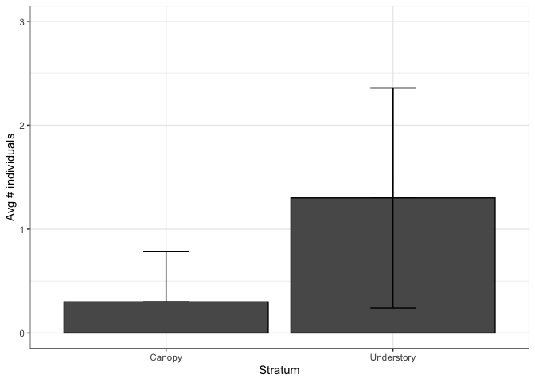
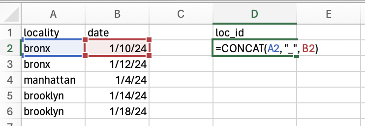

# Butterflies in the rainforest

#### Featured scientists

[Dr. David Lohman](https://lohman.ccny.cuny.edu/)

### Research Background

Rainforests are complex ecosystems that support an incredible diversity
of life. This diversity is evident not only as you walk through the
forest, but as you climb. The forest is *stratified*, meaning that the
organisms you see change as you climb up and down the forest ecosystem.
The four *strata* in a rainforest are the emergent layer, the canopy,
the understory, and the forest floor.

The emergent layer is composed of the tallest trees that tower above the
rest of the forest. They stick out, vulnerable to the often violent
weather. Plants and animals adapted to this strata must be able to
withstand intense light, shifts from rain storms to dryness, and
blustering wind. Due to this harsh environment, diversity is lower than
the other strata, although the organisms’ adaptations can be marvelous.

The canopy is the thick layer of greenery below the emergent layer. On
average about 20 feet thick, it shields its inhabitants from the intense
weather fluctuations that batter the emergent layer. Sunlight enters
through tiny openings, scattering across the lower strata, resulting in
dim, rather than brilliant light. Rain is reduced to fine droplets and
sheets pouring down tree trunks and wind is almost non-existent except
for forest openings. The canopy contains the most species of the four
strata, where plants, animals, and fungi form intricate relationships
with each other. Trees and flowering plants require animals for
dispersal rather than wind, resulting in at least some species flowering
at any point of the year. While many charismatic vertebrates inhabit the
canopy, like toucans and howler monkeys, the vast majority of animal
species in the canopy are insects. Hundreds of species of beetles can be
found on a single tree!

The understory is made up of young and short trees, shrubs, and plants
without woody stems. It is even more dim than the canopy, forcing
flowering plants to use more extreme methods to attract pollinators-
larger, paler flowers and intense fragrances from sweet to smelly. Less
dense vegetation allows for flying animals to move more freely. This
also attracts their predators, which include tree frogs hunting flies
and spiders catching birds! Frogs enjoy the higher humidity, which
provides a suitable environment for their gelatinous eggs to develop.

The forest floor is very dark- a tiny fraction of light from the
emergent layer makes it all the way down. Organisms adapted to obtaining
their nutrition from decaying matter thrive here- fungi, plants, and an
abundance of leaf-litter insects. Foraging animals like peccaries and
armadillos root through the detritus, eating plant tubers and insects.
Their predators lurk in the shadows- jaguars and cayman stalk their
unsuspecting prey until the right moment.

Butterflies occupy all four strata, with brilliant blue morphos
fluttering above the emergent layer, fruit-feeding nymphalids traversing
the canopy and understory, and low-flying Haertini cruising above the
forest floor.

The outstanding diversity of butterflies (over 18,700 species
worldwide!) is evident at all rainforest strata, although their
diversity is most pronounced in the canopy and the understory. While the
canopy and understory are close together, many species are restricted to
one stratum or the other. Butterflies are adapted to the unique
ecological characteristics of the strata. For instance, an abundance of
nectar-rich flowers in the canopy will attract certain butterflies,
while an abundance of shelter and prey in the understory may attract
others.

Dr. David Lohman and his colleagues are interested in understanding the
evolutionary relationships of butterflies and the evolution of their
ecological traits. The stark differences in the number of species and
their abundance across rainforest strata provide the opportunity to
understand *why* these differences occur. Over the course of three years
of field work in Thailand rainforests, Dr. Lohman and colleagues trapped
butterflies in the canopy and understory. In addition to counting and
classifying the butterflies they trapped, they collected weather data
for each trap, noting aspects of the temperature, humidity, rainfall,
and more about each trap and when it was sampled. A portion of these
data are summarized in the section ***Scientific Data*** below.

### Scientific Questions

Q1: Are butterflies more abundant in the canopy or the understory?

Q2: What aspects of the environment influence butterfly abundance?

### Scientific Data

| Stratum    | Temp. (Cº) | % humidity | \# individuals |
|:-----------|-----------:|-----------:|---------------:|
| Canopy     |       27.0 |       75.5 |              1 |
| Canopy     |       27.8 |       76.0 |              0 |
| Canopy     |       27.0 |       70.5 |              0 |
| Canopy     |       26.0 |       78.0 |              1 |
| Canopy     |       28.0 |       77.0 |              0 |
| Canopy     |       25.9 |       77.6 |              0 |
| Canopy     |       27.5 |       72.0 |              0 |
| Canopy     |       29.0 |       71.0 |              0 |
| Canopy     |       30.0 |       75.5 |              1 |
| Canopy     |       29.0 |       74.0 |              0 |
| Understory |       30.0 |       68.0 |              1 |
| Understory |       30.6 |       68.3 |              2 |
| Understory |       25.5 |       76.5 |              3 |
| Understory |       27.8 |       73.5 |              1 |
| Understory |       30.0 |       69.0 |              0 |
| Understory |       29.0 |       70.0 |              1 |
| Understory |       30.0 |       72.0 |              1 |
| Understory |       26.0 |       74.0 |              0 |
| Understory |       29.5 |       75.0 |              1 |
| Understory |       23.0 |       74.0 |              3 |

1.  ***Which data will you need to answer Q1?***

***Dependent variable:***

***Independent variable(s):***

Here is a relevant graph to answer Q1:

2.  ***Which data will you need to answer Q2?***

***Dependent variable:***

***Independent variable(s):***

Here are a couple graphs relevant to Q2:

3.  ***What are the treatment groups for both questions the authors are
    trying to answer?***

      

4.  ***Do the authors have a control group? If so, what is it?  
      
    ***

5.  ***Is the study design Dr. Lohman and colleagues used an
    observational study or an experiment? Why?***

### Interpret the data

6.  ***Based on the above plots, what can the authors say about Q1? What
    about Q2?***

## Excel exercise

Today you’re going to learn two more data manipulation strategies that
help you organize and understand your data.

### Sorting

The first is sorting your data. Often your data has an order to it,
whether it is alphabetical, date-time, or numerical. You may want to
know the minimum or maximum values in your data set, or know how other
variables are structured according to your ordered variable- for
instance, you can get a quick look to see if the weather has gotten
warmer over time by taking a data set with dates and temperature and
ordering it according to the date! Although the best way to get these
kinds of insights is through data visualization, which we will explore
next week, ordering your data is a great first pass. To get you up to
speed, I will guide you through the basics. If you would like to get
some more practice, you can follow the examples in this [W3Schools
exercise](https://www.w3schools.com/excel/excel_sort.php). To follow
along with their examples, open a blank spreadsheet and copy-paste the
values they use in the example (the `Copy Values` button) into the
spreadsheet.

### Concatenating

The second is concatenating cells and columns. This is the opposite of
what you learned last week- Text to Column. Concatenating involves
taking two cells or columns and joining them in a new column using the
`CONCAT()` function in Excel. This is often useful when you want to
create unique IDs for your observations. For instance, say you have a
column with the locality name and a column with the date you visited the
locality:

You can use the `CONCAT()` function to combine the two columns into a
unique identifier for that locality and date:

Where the “\_” in the middle is called a *delimiter*. It splits the
output like so:

You may notice that the numbers at the end of the ID don’t look like the
dates you entered- that is because Excel likes to do funny things with
dates under the hood and is okay, as long as each value is unique! I’ll
show you more examples in class, but see this [W3Schools
tutorial](https://www.w3schools.com/excel/excel_concat.php) for more
practice.

### Exercise

Download this spreadsheet of the [raw butterfly abundance
data](https://bbhosted.cuny.edu/webapps/blackboard/content/listContentEditable.jsp?content_id=_84317325_1&course_id=_2373132_1)
from Blackboard. Sort the data by the `temp_c` from smallest to largest
and answer the following question:

7.  ***What is percent humidity and number of specimens associated with
    the lowest temperature in the data set?***

After answering the question (and all questions before), make sure to
upload your Excel spreadsheet and the worksheet to Blackboard!

Excel materials inspired or sourced from
[W3Schools](https://www.w3schools.com/). Lab materials inspired by [Data
Nuggets](https://datanuggets.org/).
