# Regulation of cone photoreceptor development

#### Featured scientist

[Dr. Mark Emerson](http://emersonlabccny.com/)

### Research Background

Cones are the photoreceptor cells responsible for color vision. They’re
located in the retina of the eye.

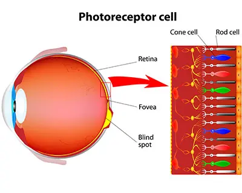

Early in the development cycle of a vertebrate embryo, eyes and their
cones have not yet developed. The cells that will eventually become
cones are *undifferentiated*, which means that they haven’t achieved
their specialized functions yet. The developmental steps to becoming
specialized involve biochemical signaling pathways. Signaling pathways
tell cells to do things like *cell proliferation* “split into more
cells”, *cell differentiation* “become this type of cell”, *cell fate*
“stop making more cells”, or even *cell death* “tell them to die”.

Of the many signaling pathways, **Notch signaling** is especially
important in the development of cone cells. Notch signaling involves
communication between cells so the appropriate types and amounts of
cells develop. Notch signaling performs all of the functions reported
above- cell proliferation, cell differentiation, cell fate, and cell
death. If Notch signaling goes awry, it can result in many types of
disease, with some examples including cancer (too many of the wrong cell
proliferating) and different types of retinal disease. Discovering which
of these functions Notch signaling performs at specific points in the
developmental process is crucial to treating disease.

To inform the development of therapies to treat retinal disease,
Dr. Emerson and colleagues study the cellular development of vertebrate
cone receptors. In the paper we’re investigating today, they uncover the
role of Notch signaling in the development of cone photoreceptor cells
Chen and Emerson (2021). The authors used genetic mechanisms to either
inhibit or promote Notch signaling at different points in the cone cell
development cycle. After performing their manipulation, they quantified
the formation of different retinal cell types. This gave the authors
clues as to how Notch signaling influences the progression from
undifferentiated cells to specialized cone cells.

The method Dr. Emerson and colleagues used to inhibit Notch signaling
was the MAML-DN protein construct. They inserted MAML-DN into
undifferentiated retinal cells to see how inhibiting Notch signaling
influences the formation of specialized cone cells. To make sure that
MAML-DN is inhibiting Notch signaling, they used the Hes5::GFP reporter.
This reporter activates when Notch signaling occurs. If MAML-DN is
successful in inhibiting Notch signaling, the authors expect low levels
of Hes5::GFP. This is the first step the authors take to investigate the
role of Notch signaling in vertebrate cone formation.

### Scientific Question

Does MAML-DN inhibit Notch signaling in vertebrate retinal cells?

### Hypothesis

If MAML-DN inhibits Notch signaling, then we expect to detect lower
amounts of the Hes5::GFP reporter in retinal cells.

### Scientific Data

| treatment | perc_hes5 |
|:----------|----------:|
| Control   |  7.019961 |
| Control   | 10.389764 |
| Control   | 12.221682 |
| Control   |  4.435266 |
| MAML-DN   |  2.329984 |
| MAML-DN   |  2.927656 |
| MAML-DN   |  2.773421 |
| MAML-DN   |  7.332150 |

Table 1. Data used in the study. The ‘treatment’ column indicates the
treatment applied to the retinal cells, while the ‘perc_hes5’ column
indicates the percentage of cells in a culture detected with the
Hes5::GFP reporter. Each observation is a replicate cell culture.

1.  ***What are the two treatment groups?***

## Data visualization

Data visualization is a critical component of the research process.
Visualizing data shows you general trends in the data, any potential
outliers or problematic observations, what the distribution of your data
looks like, and more. While there are many ways to visualize data and a
deep literature on visual design- the [Fundamentals of Data
Visualization by Claus Wilke](https://clauswilke.com/dataviz/) is a
great (free) introduction to the topic if you’re interested- we will
focus on four main chart types:

- Histogram

- Scatterplot

- Box and whisker

- Bar plot

#### Histogram

The histogram is designed to visualize a single, continuous variable. A
**continuous variable** is obtained through *measurements* and can be
any real number within a range. Things like height, weight, temperature,
speed, etc. are all continuous variables. The height of the bars
indicate the number of observations within a particular range. The width
of the bin reflects the range of values within it and can significantly
impact how you interpret the plot! There is no hard and fast rule to
creating or interpreting them, other than to try to show the
distribution of the data as accurately as possible and to always
critically assess whether the plot is properly representing the data.

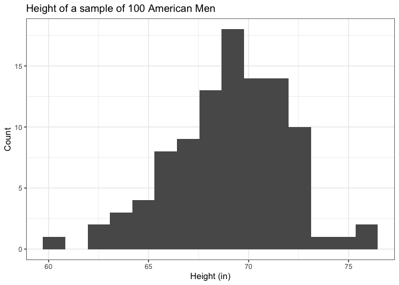

#### Scatterplot

A scatterplot is designed to visualize the relationship between two
continuous variables. Typically, the variable on the x-axis (horizontal
axis) is an independent variable, while the variable on the y-axis is a
dependent variable, although this doesn’t have to be the case. These can
give you a quick idea of whether two variables are correlated and what
sort of pattern their relationship follows (linear or non-linear).

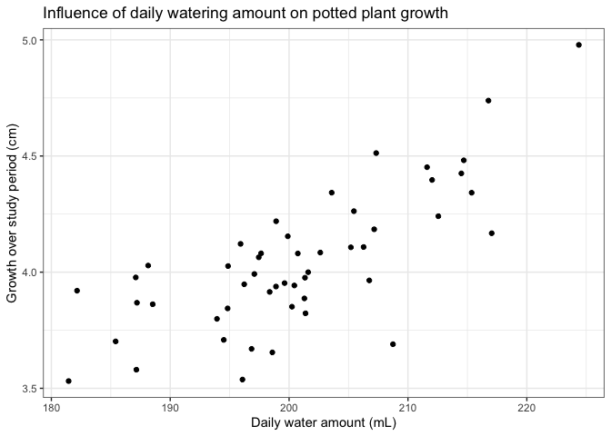

#### Box and whisker plot

These are also known simply as “boxplots”. They are useful for comparing
the distributions of groups of continuous variables. These are
especially relevant in experiments when you are comparing multiple
treatment groups. You can get a quick idea about if the middle or the
range of values between different groups are different from each other.
Each segment of a box and whisker plot have meaning, outlined below:

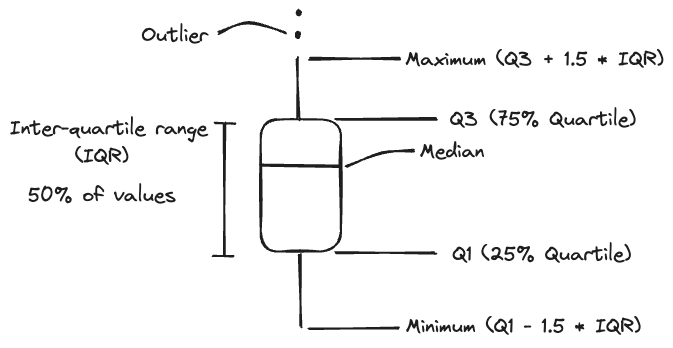

This gives you an idea about the distribution of variables without
plotting every single data point. The median represents the middle, the
IQR represents where half of the values are distributed, while the upper
and lower whiskers represent extremes. Anything beyond the range of the
whiskers is considered an outlier. Here is an example comparing male and
female African Savanna Elephants:

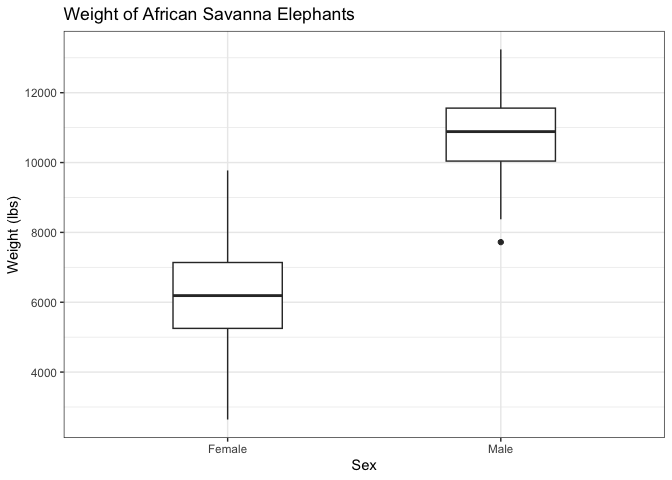

#### Bar plot

Bar plots are used to compare counts of **discrete** or **categorical**
variables. Discrete variables are real numbers that can only take on
certain values, while categorical variables are non-numeric groups. Both
can be counted.

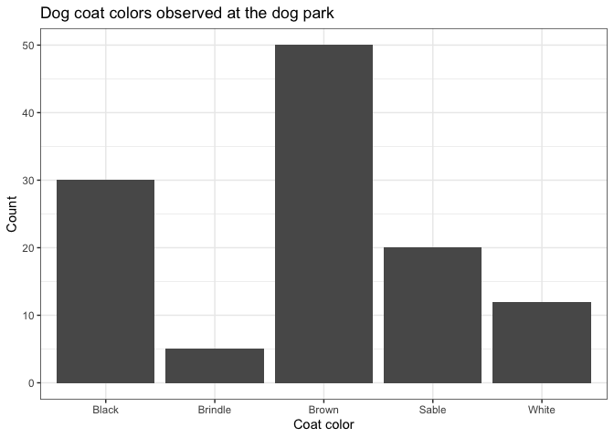

## Excel exercise

In Excel, creating charts can be simple, but customizing them leaves you
a lot of options. To create a chart:

1.  Select the data you would like to plot

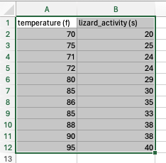

2.  Insert \> Select chart

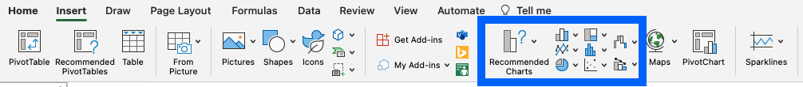

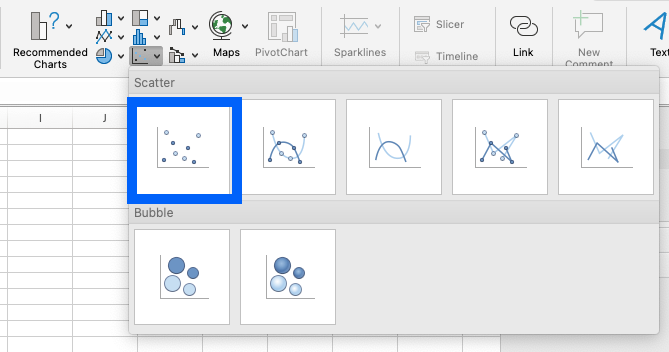

3.  Adjust chart elements

Most automatic charts that Excel generates will need some tweaking. For
instance, this is what is automatically spit out when I select a
scatterplot for that data:

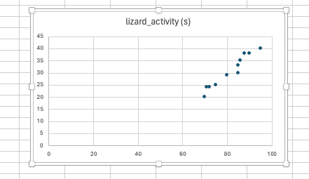

It needs a little work. The range of the axes is too long, the axes
aren’t appropriately labeled, and the chart title isn’t informative.
There are myriad ways to customize an Excel chart, and [this YouTube
tutorial](https://www.youtube.com/watch?v=eHtZrIb0oWY) does a pretty
good job of going through the basics. It would take me a while to go
through all of the options, and I will demonstrate some of the more
important features live, but after playing around, you can achieve
something like this:

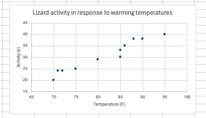

For today’s exercise, you are going to make a **box and whisker**
**plot** in Excel of Dr. Emerson and colleague’s data. The data is
[available as an Excel workbook on
Blackboard](https://bbhosted.cuny.edu/webapps/blackboard/content/listContentEditable.jsp?content_id=_84453334_1&course_id=_2373132_1).

***Use the box and whisker plot to answer the following questions**.
**Make sure to submit your Excel workbook along with the Lab worksheet
to Blackboard.***

### Interpret the data

2.  ***Based on the boxplot, does the data support the authors’
    hypothesis?***

3.  ***Suppose you want to visualize the distribution of each treatment
    individually. What visualization technique (histogram, scatterplot,
    boxplot, or bar plot) would you use?***

### References

Chen, Xueqing, and Mark M. Emerson. 2021. “Notch Signaling Represses
Cone Photoreceptor Formation Through the Regulation of Retinal
Progenitor Cell States.” *Scientific Reports* 11 (1): 14525.
<https://doi.org/10.1038/s41598-021-93692-w>.

### Before you leave

Fill out the [Weekly Feedback
Form](https://forms.gle/RCWtYoAtQGNd8JL38).

Lab materials inspired by [Data Nuggets](https://datanuggets.org/).
