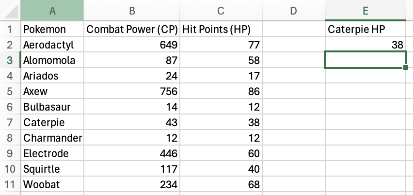

# Mechanisms of antibody production

#### Featured scientist

[Dr. Bao Vuong](https://www.bqvlab.org/)

### Research Background

Our immune system is complex network that involves the interaction
cells, proteins, tissues, and organs to defend us against germs and
microorganisms. At its core, the immune system functions by recognizing
foreign substances (*antigens*) in the body and producing proteins
(*antibodies*) to fight against them. There are a diverse set of
mechanisms that allow the body to recognize antigens, and another
diverse set of mechanisms to fight them.

In the featured study, Dr. Bao Vuong and colleagues seek to understand
how a body fights antigens (Sible et al. (2023)). Different antigens
require different antibodies to fight them. The different flavors of
antibodies that are produced are known as *Ig isotypes*, where an
*isotype* is a set of molecules that share certain features. The main Ig
isotypes in mammals include:

- **IgM**, which is activated early in an immune response

- **IgG**, which provides long-term immunity

- **IgA**, which helps protect against antigens at mucosal surfaces, and

- **IgE**, which is involved in allergic reactions and defends against
  parasites

They are generated through a genetic mechanism called *class-switch
recombination* (CSR), which involves rearranging the DNA of the antibody
in response to a trigger.

> Antibodies are shape-shifting molecules that take on different forms
> for whatever they’re needed for.

If CSR gets disrupted, the body is unable to respond appropriately to
antigens, which can lead to a host of problems, including immune-related
diseases or an inability to respond to infections. Since CSR is a
genetic mechanism, mutations on certain genes may lead to its
disruption. This led Dr. Vuong and colleagues to investigate the impact
of two genes, ATM and MSH2 on CSR. These two genes are suspected to
influence immune function, but the mechanism is unknown. They
investigated the genes’ impact on CSR by “knocking out” (removing) the
two genes in mice. They monitored the production of an Ig isotype, IgG,
in mice with and without the two genes. If ATM and MSH2 have an impact
on CSR, the authors expect IgG to be higher in mice that have the the
genes versus the mice that don’t.

### Scientific Question

What is the impact of the ATM and MSH2 genes on class-switch
recombination?

### Hypothesis

1.  ***Based on the background information and question, what is the
    authors’ hypothesis?***

### Scientific Data

| individual_id | genotype | igG_ugmL |
|:--------------|:---------|---------:|
| m0001         | wt       |      724 |
| m0002         | wt       |      840 |
| m0003         | wt       |     1055 |
| m0004         | wt       |     1260 |
| m0005         | wt       |     1655 |
| m0006         | wt       |     2264 |
| m0007         | wt       |     2424 |
| m0008         | wt       |     2314 |
| m0009         | wt       |     3001 |
| m0010         | wt       |     4138 |
| m0011         | wt       |     4638 |
| m0012         | ko       |      103 |
| m0013         | ko       |       48 |
| m0014         | ko       |       10 |
| m0015         | ko       |       16 |
| m0016         | ko       |      114 |
| m0017         | ko       |      383 |

Table 1. Data used in the study. The ‘individual_id’ column is an
identification code assigned to each mouse individual. The ‘genotype’
column indicates whether the mouse had the two genes (wt) or had the two
genes knocked out (ko). ‘wt’ stands for wild-type, which is the name
given to organisms with the genotype that occur most frequently in a
natural population which, in this case, is positive for ATM and MSH2.
The ‘igG_ugml’ column is the amount of igG isotype serum present in the
individuals, with the units μg/mL.

2.  ***What are the two treatment groups?***

### Visualize the data

3.  ***Using the data in [this week’s Excel
    spreadsheet](https://bbhosted.cuny.edu/webapps/blackboard/content/listContentEditable.jsp?content_id=_84521561_1&course_id=_2373132_1),
    make a boxplot comparing igG_ugml between the two treatment groups.
    Paste a screenshot of the boxplot in the space below.***

### Interpret the data

4.  ***Based on the boxplot, does the data support the authors’
    hypothesis?***

## Filtering data in Excel

This week you are learning about filtering your data! In many instances,
you will need to only retain a subset of your data- maybe some
observations failed or were corrupted, maybe you want to focus on the
impact of two out of the three treatments you performed, or maybe you
want to see which individual a particular measurement belongs to. Excel
has many data filtering functions, but there are two workhorse functions
that will get you a long way: `XLOOKUP()` and `FILTER()`.

#### XLOOKUP()

The `XLOOKUP()` function helps you to find things in a table or range of
values by row. It works with the following logic:

- What am I trying to find?

- Where am I trying to find it?

- What do I want to return when I find it?

- What do I want to return if I don’t find it?

That logic is contained in the arguments you pass into the function.

`XLOOKUP(lookup_value, lookup_array, return_array, [if_not_found])`

- **lookup_value**- the value you want to search for

- **lookup_array**- the range of values you want to search

- **return_array**- the values you want to return

- **\[if_not_found\]**- a value to return if the value you search for
  isn’t found

There are more options that add to the flexibility of the function, but
these are the four most important arguments.

One use case is looking up the hit points (HP) of a particular Pokémon
([here is the
spreadsheet](https://github.com/connor-french/dss_2024/raw/main/data/w3_exercise.xlsx?dl=1)
if you would like to follow along):

We’ll look for the HP of Caterpie! I went ahead and named a column `E`
“Caterpie HP”. We’ll put the `XLOOKUP()` function in `E2`.

To start, specify “Caterpie” as the **lookup_value**.

Next, select the **lookup_array** you want to search the
**lookup_value** for. In this case, it’s the `Pokemon` column.

Next, select the **return_array** you want to return a value from. Here,
it’s `Hit Points (HP)` column.

Finally, just in case Caterpie isn’t in the `Pokemon` column, set
“no_pokemon” as the **\[if_not_found\]** value.

Press `Enter` or `Return` and you should get the HP for Caterpie!

The [Windows support
page](https://support.microsoft.com/en-us/office/xlookup-function-b7fd680e-6d10-43e6-84f9-88eae8bf5929)
has a great video and text with more examples if you would like to dive
deeper!

#### FILTER()

The `FILTER()` function allows you to return entire sections of a table
that satisfy a condition, compared to `XLOOKUP()` which only returns
single values. It works with the following logic:

- What range of data do you want to filter?

- What range of values do you want to filter by?

- What condition do those values need to satisfy?

- What value do you use if the condition isn’t satisfied?

That logic is contained in the arguments you pass into the function.

`FILTER(array, include, [if_empty])`

- **array**- the range of data you want to filter

- **include**- the range of values you want to filter by, followed by
  the condition those values need to satisfy

- **\[if_empty\]**- the value to use if the condition isn’t satisfied

Let’s filter the Pokémon data to only include Pokémon with Combat Power
(CP) greater than 100.

First, I added column names for the data that will be returned and added
a special column and cell that provide the value we will filter the data
by, `CP minimum`. The green box indicates where the formula will be
entered.

You’ll select the entire table as the **array**, since you want all of
the variables to be returned.

You’re going to filter based on the `Combat Power (CP)` column, so
select that column for the **include** argument.

Next, you need to add your condition to the **include** argument. Since
you want the CP to be above 100, you will use the greater-than sign
(`>`), followed by your `CP minimum` value.

There are many different conditions you can specify, but three main
conditions will get you a long way: `>`, `<`, and `=`. All three can be
used with numeric data. Values on the left must be greater than, less
than, or equal to the value on the right. Only the `=` condition can be
used with character data. You can check if words, letters, phrases, etc.
match the value on the right of the condition.

Finally, you need to provide a value to the **\[if_empty\]** argument to
specify what value to put if the condition isn’t satisfied by any of the
rows.

Press `Enter/Return` and you have a filtered table!

The [Windows support
page](https://support.microsoft.com/en-us/office/filter-function-f4f7cb66-82eb-4767-8f7c-4877ad80c759)
also has a great video and text with more examples for this function if
you would like to dive deeper!

## Excel exercise

This week, you will filter [Dr. Vuong’s immunity data in this Excel
spreadsheet](https://bbhosted.cuny.edu/webapps/blackboard/content/listContentEditable.jsp?content_id=_84521561_1&course_id=_2373132_1).
You need to complete two filtering tasks:

1.  You are interested in seeing if there are any data abnormalities in
    the wild-type (“wt”) individuals. Use the `FILTER()` function to
    return a new table with only the wild-type (“wt”) individuals.
2.  You remember that the “m0007” mouse was behaving abnormally during
    the experiment. You want to know if this odd behavior impacted its
    IgG serum amount. Use the `XLOOKUP()` function to return the
    `igG_ugmL` amount for the “m0007” individual.

Answer the following question about the data:

5.  ***Based on the IgG amount returned by XLOOKUP(), does it appear
    like the m0007 mouse’s behavior impacted its IgG serum amount? Why
    or why not?***

After you’re finished, upload the workbook and the lab worksheet to
Blackboard.

### References

Sible, Emily, Mary Attaway, Giuseppe Fiorica, Genesis Michel, Jayanta
Chaudhuri, and Bao Q. Vuong. 2023. “Ataxia Telangiectasia Mutated and
MSH2 Control Blunt DNA End Joining in Ig Class Switch Recombination.”
*The Journal of Immunology Author Choice* 210 (4): 369–76.
<https://doi.org/10.4049/jimmunol.2200590>.

### Before you leave

Fill out the [Weekly Feedback
Form](https://forms.gle/RCWtYoAtQGNd8JL38).

Lab materials inspired by [Data Nuggets](https://datanuggets.org/).
