# Secondary chromosome duplication in bacteria

#### Featured scientist

[Dr. David
Jeruzalmi](https://www.ccny.cuny.edu/profiles/david-jeruzalmi)

### Research Background

The structure of DNA in unique in bacteria compared to animals. Humans
have 46 chromosomes, which come in 23 pairs and are arranged as strands.

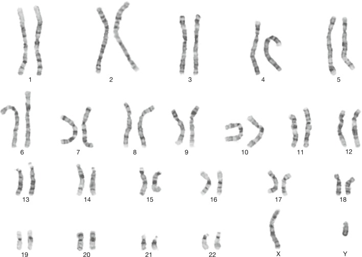

Bacteria have a single primary chromosome, which is arranged in a
circle. This chromosome contains most of the necessary (*core*) genes
for survival and reproduction. However, bacteria also have two other DNA
structures- plasmids and a secondary chromosome.

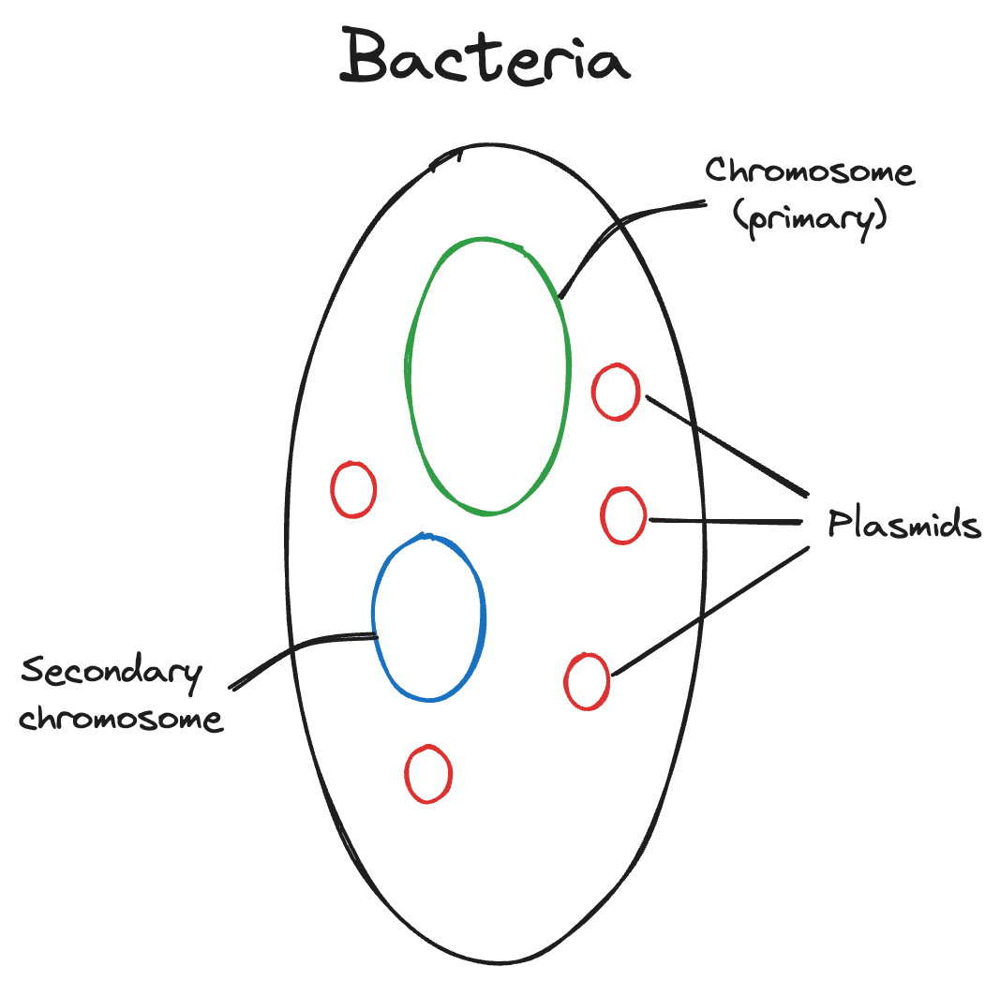

Plasmids are smaller than the chromosomes, and contain genes that help
the bacteria adapt to different environments, but are not core genes.
There can be more than one in a bacterium. Secondary chromosomes are
unique because they contain features of both the primary chromosome and
plasmids. They contain core genes along with other genes that aid in
adaptability, and there can only be one in a bacterium. The precise
mechanisms by which secondary chromosomes replicate and mutate influence
bacterial adaptation. Understanding these mechanisms can aid in
preventing disease due to bacterial adaptation to antibiotics and other
drugs.

For these reasons, Dr. David Jeruzalmi and colleagues sought to
understand the structure of the protein that initiates secondary
chromosome replication in the cholera pathogen *Vibrio cholera* Orlova
et al. (2017). If they can describe the *initiator protein’s* structure,
scientists can more accurately understand how cholera and other
pathogenic bacteria adapt. The authors think that the initiator protein,
called *RctB*, of the secondary chromosome may either be more similar to
*RctB* in the primary chromosome or to *RctB* in the plasmid. They
uncover the structure of the secondary chromosome’s *RctB* using a
variety of biochemistry methods. One method they use is to disrupt the
protein’s structure by mutating a gene, then measuring the
mass-to-charge ratio (m/z) of different domains (*i.e.* regions) of the
protein with the mutation and the protein domains without the mutation
(wild type). If the secondary chromosome’s *RctB* is closer in structure
to the plasmid’s *RctB*, then the authors expect the mutated protein
domains to have a lower m/z than the wild type protein. If the secondary
chromosome’s *RctB* is closer in structure to the primary chromosome’s
*RctB*, then the authors expect there to be no difference in m/z between
the mutated and wild type protein domains. Dr. Jeruzalmi and colleagues
conducted the experiment across three protein domains, recording the m/z
for mutants and wild type variants of the protein domains.

### Scientific Question

What is the structure of the protein that initiates secondary chromosome
replication in the cholera pathogen *Vibrio cholera*? (*You do not have
to answer this*).

### Hypotheses

H1: If the secondary chromosome’s *RctB* is closer in structure to the
plasmid’s *RctB*, then the authors expect the mutated protein domains to
have a lower m/z than the wild type protein.

H2: If the secondary chromosome’s *RctB* is closer in structure to the
primary chromosome’s *RctB*, then the authors expect there to be no
difference in m/z between the mutated and wild type protein domains.

### Scientific Data

| rctb_ID | variant_class |   mz |
|:--------|:--------------|-----:|
| rctb_01 | mut           | 4236 |
| rctb_01 | mut           | 4390 |
| rctb_01 | mut           | 3939 |
| rctb_01 | mut           | 4278 |
| rctb_01 | mut           | 3512 |
| rctb_01 | wt            | 5060 |
| rctb_01 | wt            | 5964 |
| rctb_01 | wt            | 4941 |
| rctb_01 | wt            | 5409 |
| rctb_01 | wt            | 5952 |
| rctb_02 | mut           | 4745 |
| rctb_02 | mut           | 4143 |
| rctb_02 | mut           | 3957 |
| rctb_02 | mut           | 3837 |
| rctb_02 | mut           | 3235 |
| rctb_02 | wt            | 5050 |
| rctb_02 | wt            | 5084 |
| rctb_02 | wt            | 4995 |
| rctb_02 | wt            | 5227 |
| rctb_02 | wt            | 5684 |
| rctb_03 | mut           | 3657 |
| rctb_03 | mut           | 3324 |
| rctb_03 | mut           | 3351 |
| rctb_03 | mut           | 3700 |
| rctb_03 | mut           | 3343 |
| rctb_03 | wt            | 4944 |
| rctb_03 | wt            | 4219 |
| rctb_03 | wt            | 4611 |
| rctb_03 | wt            | 4446 |
| rctb_03 | wt            | 4535 |

Table 1. A subset of the data used in the study. The ‘rctb_id’ column is
an identification code assigned to each protein domain. The
‘variant_class’ column indicates whether the protein domain was a
wildtype (wt) or had the mutant (mut). The ‘mz’ column is the
mass-to-charge ratio of the protein domain.

1.  ***What are the two treatment groups?***

## Pivot tables in Excel

A pivot table (called a PivotTable in Excel) is a powerful data analysis
tool to summarize large data sets and answer questions about the data.
It streamlines the process of selecting, filtering, summarizing, and
formatting data into easily interpretable tables and graphs. In short,
pivot tables are

- **Simple:** Pivot tables are easy to create using drag-and-drop tools
  without the need for complex formulas

- **Fast:** They are time-efficient and allow for quick rearrangement of
  data display to meet specific needs

- **Flexible:** Users can transform columns into rows, group data by any
  field, and perform advanced calculations easily

To create a PivotTable in Excel, follow these steps:

*If you would like to follow along, download [the Excel workbook from
this
link](https://github.com/connor-french/dss_2024/raw/main/data/w4_govind_flies_imperfect.xlsx?dl=1).
You might recognize it!*

1.  **Prepare Your Data:**

    - Ensure your data is well-organized with clear headings and no
      blank rows or columns.

    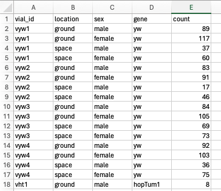

2.  **Insert a PivotTable:**

    - Select your data range.

    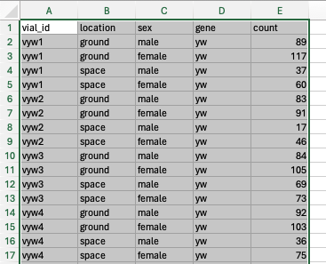

    - Go to the “Insert” tab and click on “PivotTable.”

    

    - Choose where to place the PivotTable.

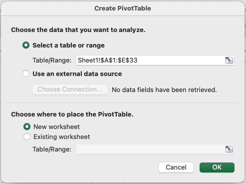

3.  **Design Your PivotTable:**

- Drag fields like names, IDs, dates, or numbers into the Rows, Columns,
  and Values areas.

- For example, to get the number of flies that survived in space versus
  on Earth (“ground”) according to their genotype (“gene”), you can drag
  the *location* field to the Rows, *gene* field to the Columns, and
  *count* field to the Values.

  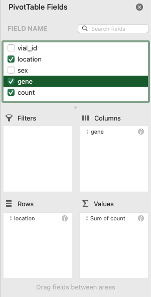

Your PivotTable should look like this:

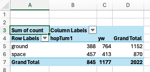

4.  **Customize Your PivotTable:**

- Right-click on Values in the PivotTable to change calculations like
  sum or average.

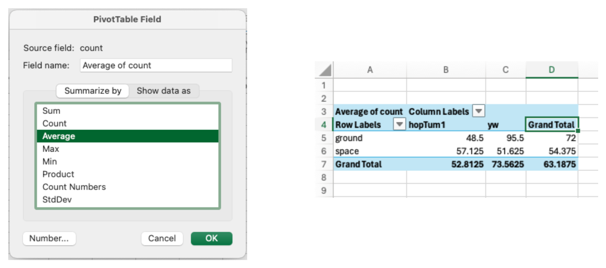

- Format numbers by right-clicking on the values and selecting “Value
  Field Settings.”

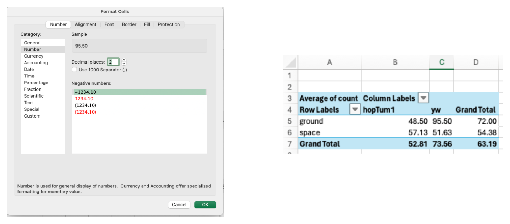

5.  **Enhance Your PivotTable:**

- Group dates or other data if needed for better organization.
- Use the “Design” tab to change the layout and style of your
  PivotTable.
- For instance, remove the “Grand Totals” column and row for your table:

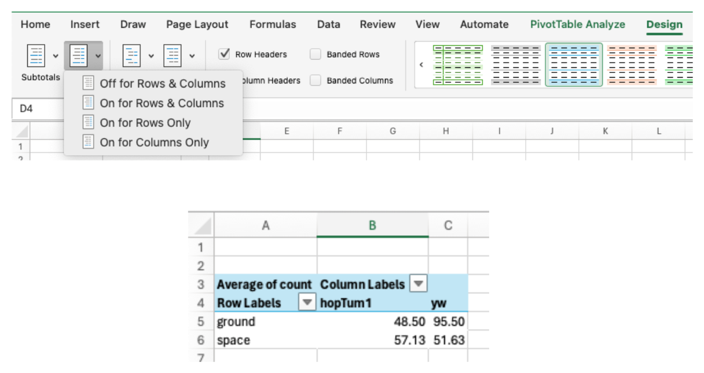

6.  **Add a chart**

- Visualize your table as a chart

- Go to the “PivotTable Analyze” tab and click on “PivotChart”

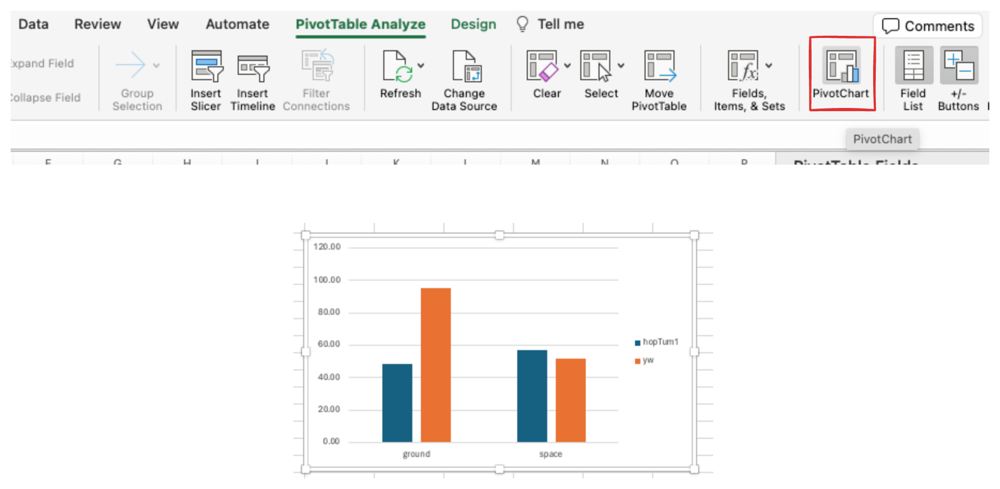

Pivot tables are very powerful for understanding your data! To dive
deeper, I highly recommend starting with [this video tutorial by Kevin
Stratvert](https://www.youtube.com/watch?v=m0wI61ahfLc).

## Excel exercise

This week, you will create a Pivot Table and data visualization for
[Dr. Jeruzalmi’s data in
Excel](https://bbhosted.cuny.edu/webapps/blackboard/content/listContentEditable.jsp?content_id=_84580432_1&course_id=_2373132_1).
You need to complete two tasks:

1.  You want to summarize your data to see if the average mass-to-charge
    ratio of the *RctB* protein domains is similar or differ between
    mutants and wild types. Create a Pivot Table that returns the
    averages of the “mz” column for each “rctb_ID” and “variant_class”,
    where the rows are *RctB* IDs and columns are variant classes.

    It should look something like this: (*it will look slightly
    different with different values*)

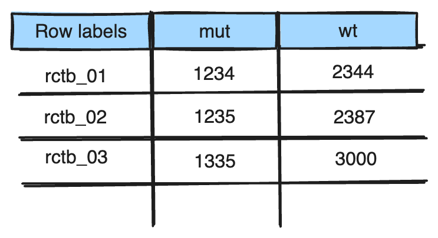

2.  From this Pivot Table, create a bar plot of the average
    mass-to-charge ratio across *RctB* IDs and variant classes.

    It should look something like this:

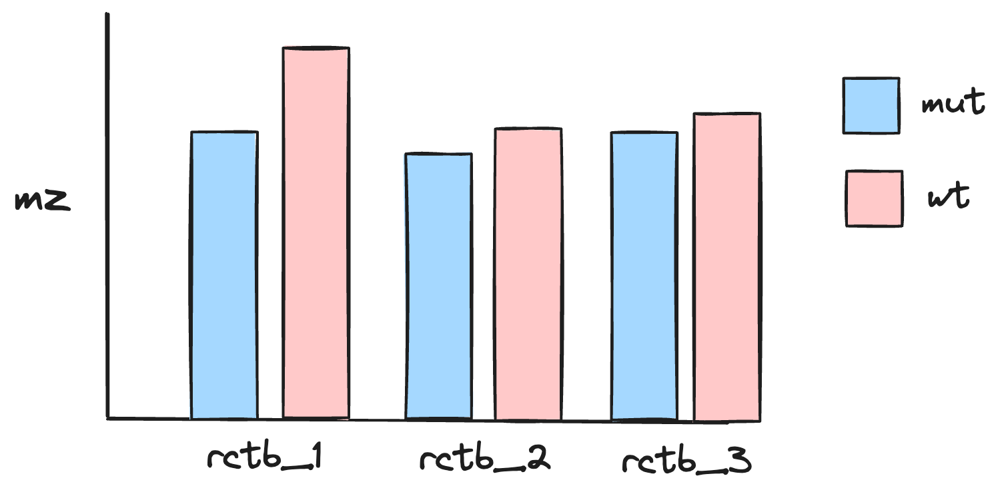

Answer the following question about the data:

2.  ***Based on the Pivot Table and bar plot, which hypothesis does the
    data support?***

After you’re finished, upload the workbook and the lab worksheet to
Blackboard.

### References

Orlova, Natalia, Matthew Gerding, Olha Ivashkiv, Paul Dominic B.
Olinares, Brian T. Chait, Matthew K. Waldor, and David Jeruzalmi. 2017.
“The Replication Initiator of the Cholera Pathogen’s Second Chromosome
Shows Structural Similarity to Plasmid Initiators.” *Nucleic Acids
Research* 45 (7): 3724–37. <https://doi.org/10.1093/nar/gkw1288>.

### Before you leave

Fill out the [Weekly Feedback
Form](https://forms.gle/RCWtYoAtQGNd8JL38).

Lab materials inspired by [Data Nuggets](https://datanuggets.org/).

Excel background sources:

\[1\]
<https://support.microsoft.com/en-us/office/video-create-a-pivottable-manually-9b49f876-8abb-4e9a-bb2e-ac4e781df657>
\[2\] <https://www.youtube.com/watch?v=9NUjHBNWe9M> \[3\]
<https://www.journalofaccountancy.com/newsletters/extra-credit/use-excel-pivottables-to-analyze-grades.html>
\[4\]
<https://careerfoundry.com/en/blog/data-analytics/how-to-create-a-pivot-table/>
\[5\] <https://www.youtube.com/watch?v=aQbiA_l1MoM>
